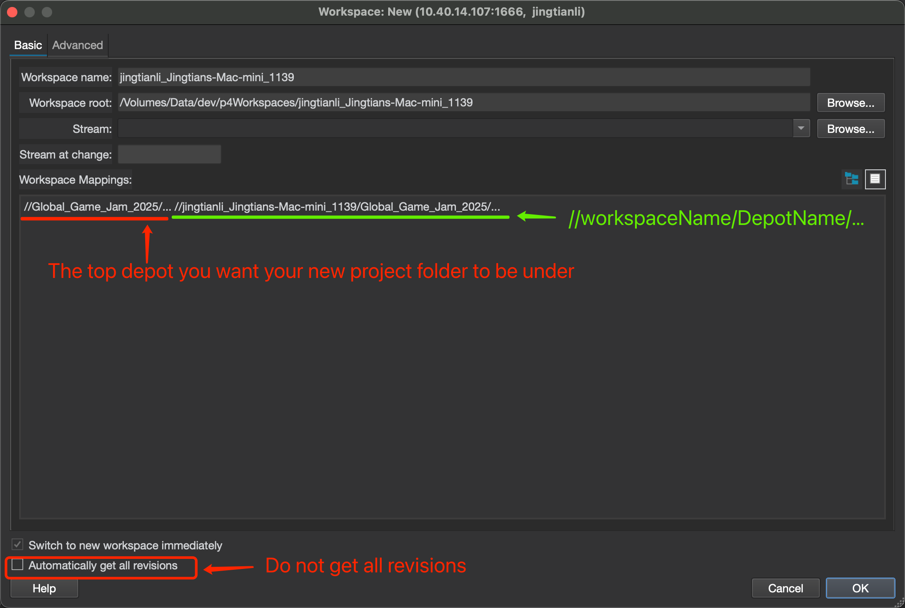
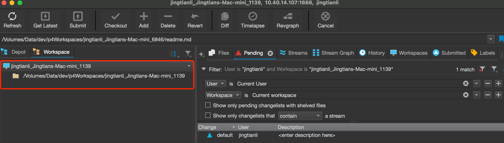
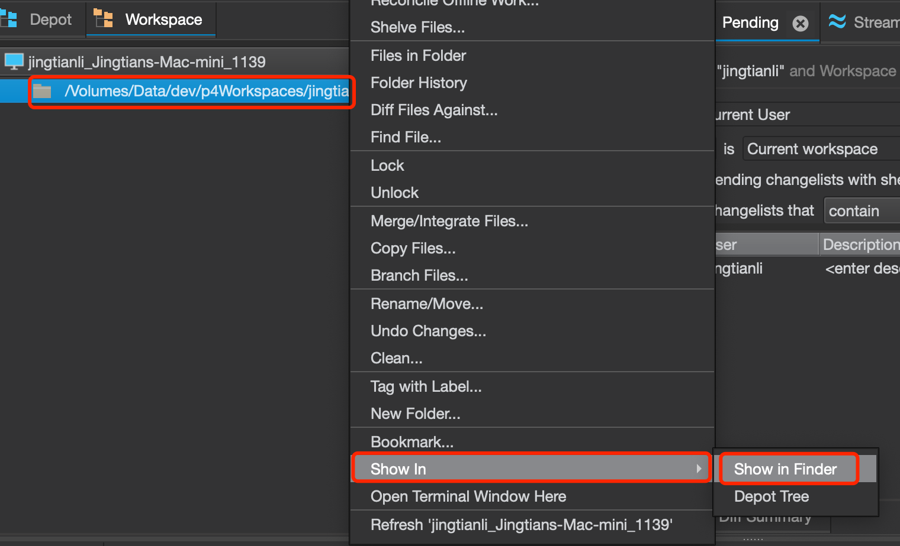
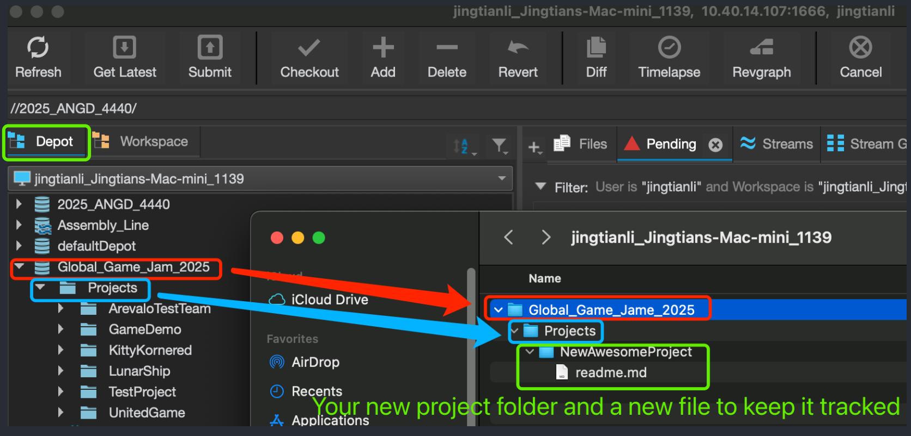
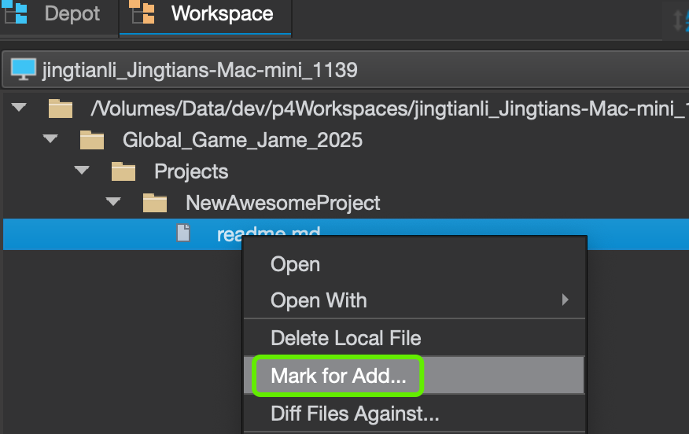
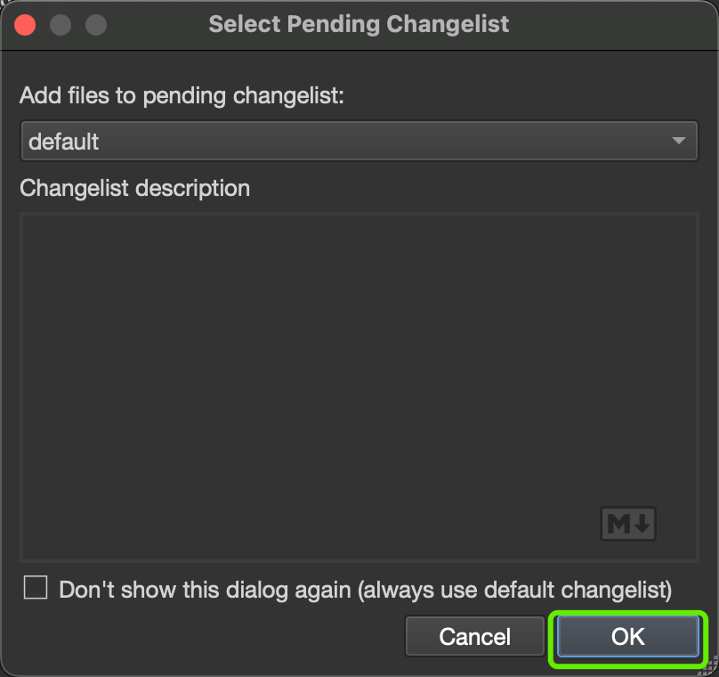
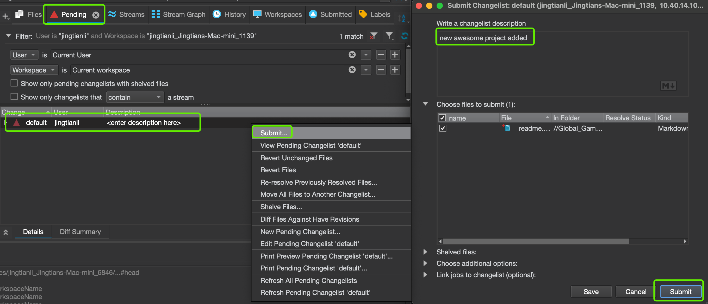

# Add your New Project

* Create a new workspace with the following configuration:


For example, if you want to add a new subfolder in the Global_Game_Jame_2025 Deport, you map it to your new workspace, with the name of the depot under the workspace name.

Also make sure you have ```Automatically get all revisions``` checked off. Click on ok to create the workspace, once created, because we are not getting all revisions, your new workspace should all be empty:




* After creating the workspace, you go to the folder of the workspace by righing click on the workspace under the ```Workspace``` tab. and select ```Show In``` and ```Show In Explorer``` (or Show in Finder on MAC OS):



* Create a folder of the name of the depot and all the subfolders you want your new subfolder to be under,  create your new folder under it, and add any single new place holder file to force the server to add the folders(P4 do not accept empty folders), it's easier to to to the ```Depot``` tab and check the folder structure there(the image has a typo in the name, it should be Jam, not Jame):

 

* Right click on your new file, and select ```mark for add```. 



in the pop up window, just click ok to add it to the default changelist:



* Go to the ```Pending``` tab, and right click on the default change list, click ```Submit...```, in the pop up window, give it a description and press the ```Submit``` button.



Your project subfolder shold now apear on the server.
