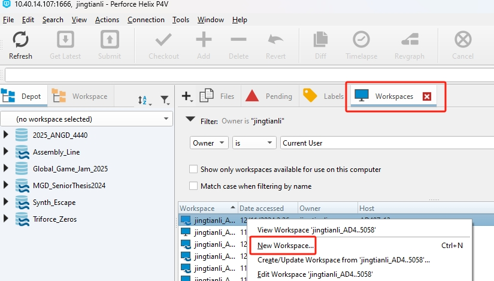
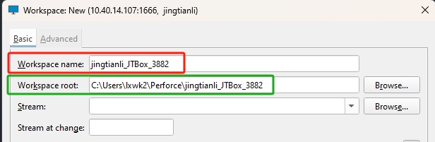
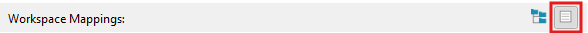
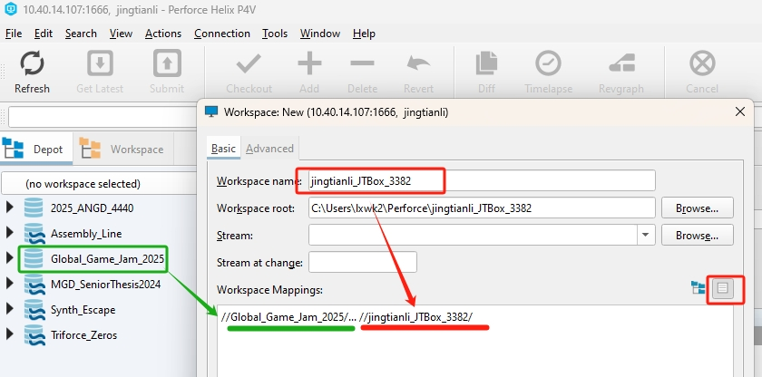
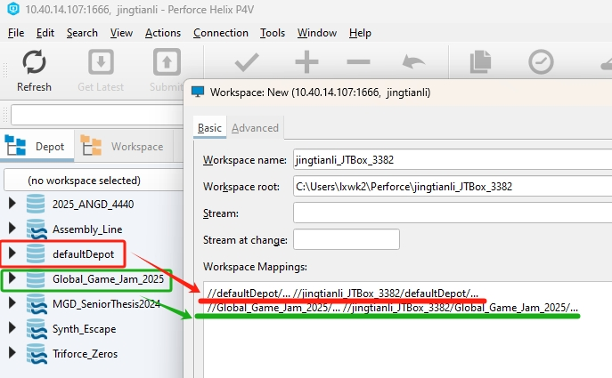
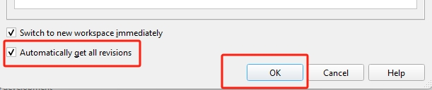
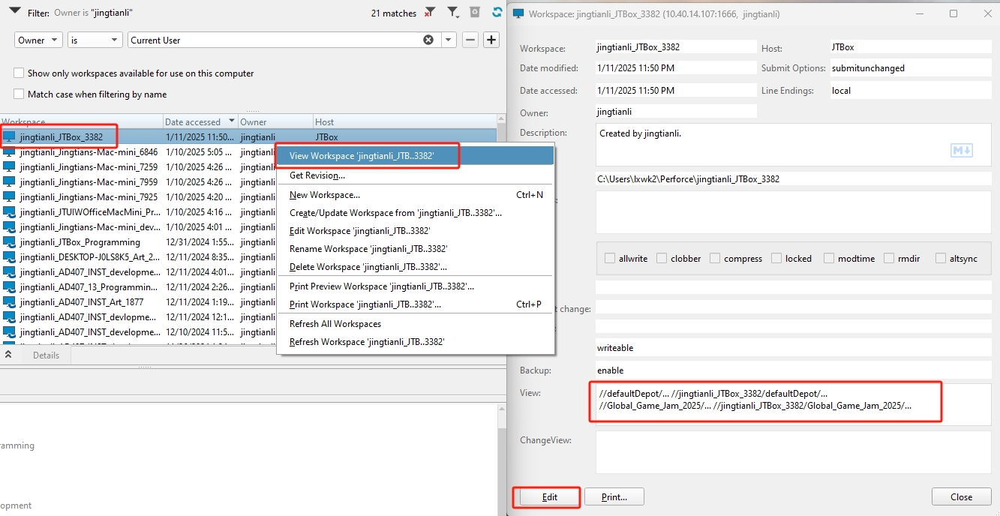

# Making the Workspace

A workspace is a local directory(folder) on your computer that syncs with a portion of the files on the p4 server. What portion or portions of the server is synced to your directory is defined by the ```View``` or ```Mapping``` of the workspace.

### Make your Workspace

* In the ```Workspace``` tab, right click on any of the items in the workspace list, and click ```New Workspace```, if the ```Workspace``` tab do not exists, press ```Ctrl + 5``` to open it. you should also be able to find it under the ```Main Menu```->```View```.



* In the pop up window, the ```Workspace name``` is the unique name of your workspace, by default, it is composed with ```username```+```ComputerName```+```RandomUniqueNumber```. You can give it a different name but it needs to be globally unique, and have good infomation like user name and the computer. Be aware that this workspace is recored on the server, and deleting the folder on your local computer will not remove that record. The ```Workspace root``` is the local root directory of the Workspace, it is where you have files synced with the server. Pick a good place you can easily find.



* You will then configure what part of the server are you going to sync in the ```Workspace Mappings``` section, I recommend you set to ```view workspace mapping as text```:



Configure the text below as:

```
//TheDepotYouWantToSyncWith/... //YourWorkSpaceName/
```

the first ```//``` means the root directory of the perforce server. the second ```//``` means your local machine. the ```/...``` means every file and subdirectories. The text above then translate as:

Everything under ```TheDepotYouWantToSyncWith``` on the ```Server``` syncs to the folder of ```YourWorkspace``` on your local machine.

for example, if you want to work on the depot ```Global_Game_Jam_2025```, you can then map it to your workspace by using the config (be aware that the workspace name part is suppose to be yours instead of the example one):

```
//Global_Game_Jam_2025/... //jingtianli_JTBox_3382/
```
The following image is showing such config:



Say we have 4 projects: A, B, C, D, each is a sub directory in the ```Global_Game_Jam_2025``` depot, and you are only working on Project A and don't care about the others. then your configuration will be:

```
//Global_Game_Jame_2025/A/... //yourWorkSpaceName/...
```
Notice that we added ```A/...``` Under the ```Global_Game_Jame_2025```, so we are only mapping the A subdiretory of the ```Global_Game_Jame_2025``` to your local workspace.

Another situation is that you are assigned to work on both A, and B, then what you can do is add 2 lines:
```
//Global_Game_Jame_2025/A/... //yourWorkSpaceName/A/
//Global_Game_Jame_2025/B/... //yourWorkSpaceName/B/
```
Notice that we will have to add ```A/...``` and ```B/...``` to your workspace to differenciate them. Also be aware that if you added some file to the folder ```YourWorkspaceName```, because that folder is not mapped to anything (Only the A and B subfolders are), the file will simply not be considered as new files.

And if you are wondering, yes, you can map multiple depots to multiple subfolders to a sinlge workspace, for example, a new dummy empty depot called defaultDepot is created, the configure in the following image maps both depot to the new workspace:



Or to put it simply, you can map any number of different parts of the server to your workspace.

* After you have configured your mapping (some times refer as view) of your workspace, I also recommend to check on ```Automatically get all revisions``` to get all the files you mapped to your workspace right away. if you do not check it on, your workspace will be empty. Click the ```OK``` button to finish creating your workspace.



* If you did something wrong or changed your mind, you can right click on the workspace you just created in the workspace list, and click ```View Workspace 'your work space name'```. In the pop up window, you can alter the settings(like the ```View```) of your workspace, and click the ```Edit``` button to make the change.

