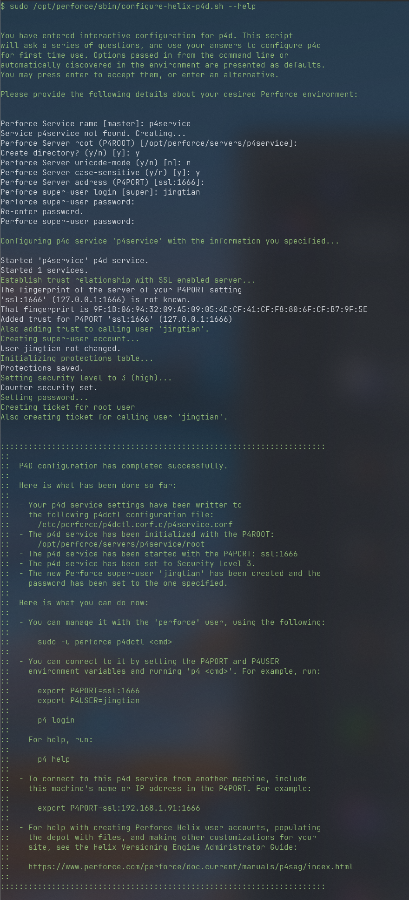

# How to Configure the Server On Linux

This page is based on: [Perforce Official Documentation](https://help.perforce.com/helix-core/quickstart/current/Content/quickstart/admin-install-linux.html)

## Installation
__Make sure you have sudo access on the computer where you are installing Helix Core Server.__

* Download the Perforce public key:

```sh
wget https://package.perforce.com/perforce.pubkey
``` 
* Get the fingerprint of the public key:

```sh
gpg -n --import --import-options import-show perforce.pubkey
```
* Verify the downloaded key matches the authentic Perforce fingerprint:

```sh
$ gpg -n --import --import-options import-show perforce.pubkey | grep -q "E58131C0AEA7B082C6DC4C937123CB760FF18869" && echo "true"
```
If the output is true, the key is valid.


* Add the public key to your keyring:
```
$ wget -qO - https://package.perforce.com/perforce.pubkey | sudo apt-key add -
```
we may get a warning says this method is deprecated:
```
Warning: apt-key is deprecated. Manage keyring files in trusted.gpg.d instead (see apt-key(8)).
```
But it will work on Debain.
But if not working, we can try to use the suggested gpg format:

1, Download and convert the key to gpg:

```sh
wget -qO - https://package.perforce.com/perforce.pubkey | gpg --dearmor -o perforce.gpg
```
2, Move the Converted Key to ```/etc/apt/trusted.gpg.d/```
```sh
sudo mv perforce.gpg /etc/apt/trusted.gpg.d/
```
3, Update Your Package List:
```sh
sudo apt-get update
sudo apt update
```


* Create a file for the Perforce repository:

```
$ sudo nano /etc/apt/sources.list.d/perforce.list
```

* To add the new repository to the package manager, add the following line to the file you created:
```
deb http://package.perforce.com/apt/ubuntu noble release
```
Save the file.

* Refresh local packages:

```sh
sudo apt-get update
```
* Install Helix Core Server using the built-in Ubuntu package manager:

```sh
sudo apt-get install helix-p4d
```

* Enter Y to confirm and wait for installation to complete.


## To complete Helix Core Server installation, configure the Perforce service.

* Run the configuration in interactive mode:

```sh
sudo /opt/perforce/sbin/configure-helix-p4d.sh
```
The configuration script displays a summary of default settings and any settings optionally set with a command-line argument.

Provide information prompted by the configuration script:

__Service Name:__ Used when starting and stopping the service.

__Server Root:__ P4ROOT where versioned files and metadata are stored.

__Unicode Mode__ Off by default. If you are planning to install Helix Swarm after setting up Helix Core, enable Unicode mode. Swarm requires Unicode mode to ensure that all characters are displayed and handled correctly.


## __Warning:__

If you turn Unicode mode on, you will not be able to turn it off. Be sure you are familiar with Unicode functionality when selecting this mode. See Unicode mode in Helix Core Server Administrator Guide for information.

__Case Sensitivity:__ On by default. In most cases, setting up a case sensitive server with a case-check trigger to avoid case collisions is the best option. If your organization is developing only with and for Windows, you might want to set up a case insensitive server instead.

__Server Address:__ P4PORT, which is the host and port the Helix Core Server listens on, and whether to communicate in plain text or over SSL.

__Superuser login:__ userid for a new user with super level privileges. To learn more about super users, see Access levels in Helix Core Server Administrator Guide.

__Superuser password:__ Password for the new super user. This user has unlimited privileges, so a strong password is required.

When configuration is complete, a summary displays details about what changed and where settings are stored.

You can now connect to the Helix Core Server service, or you can manage the service using the p4dctl utility. For example:
sudo -u perforce p4dctl start -t p4d p4dmaster <server_name>

To learn more about configure-helix-p4d.sh script, see Post-installation configuration in Helix Core Server Administrator Guide. 

* Here is an example:

