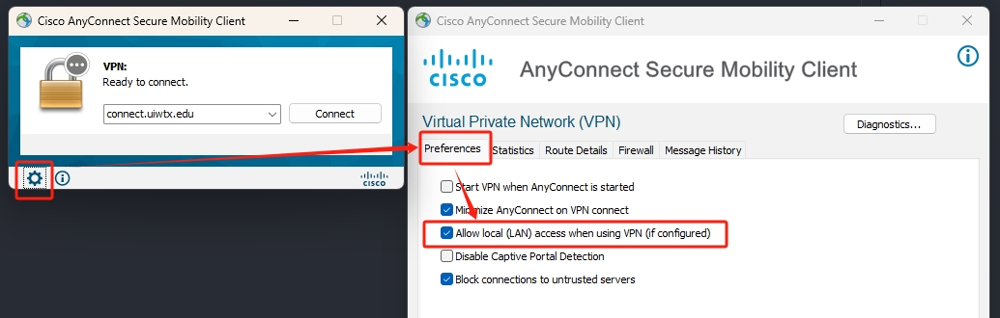

# Working From Home

* ```Important:```If you are a student, ask [Professor Li](mailto:jili1@uiwtx.edu) to add you to the VPN access group.

* you will need to download the [Cisco Any Connect](../Assets/anyconnect-win-4.10.05095-core-vpn-webdeploy-k9.zip) in order to connect to the University. 

* Follow the Instructions to download and run ```Cisco AnyConnect```, before you click on connect, make sure you click on the little gear icon, go the the ```Preferences```, and check on ```Allow local(LAN) access when using VPN(if configured)```



* the Address should be ```connect.uiwtx.edu```, click on connect, and in the login page, use your UIW credentials to autheticate.

* If the connection is successful, then you can access the P4 server.  